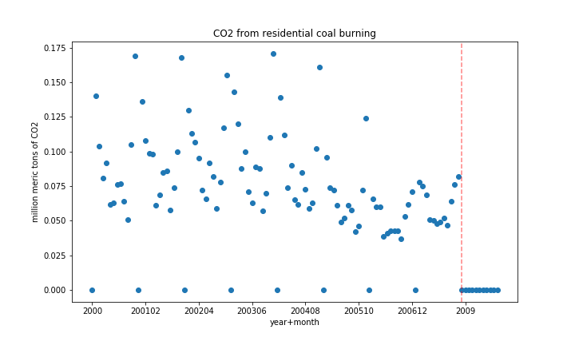
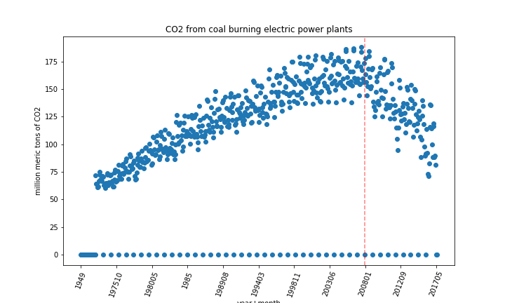
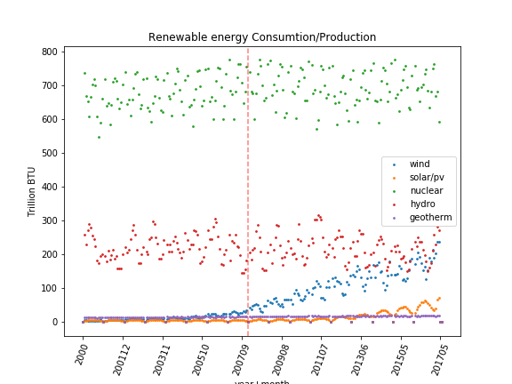

# Energy Statistics

## The Data:
The data set that will be used in this project is called 'US Energy Statistics' and can be found [here.](https://www.kaggle.com/sohier/us-energy-statistics?select=TOTAL.json) It consists of nine JSON files: 
 - **Coal:** Ash content for each US state per year and import/export prices.
 - **Electric system operating data:** hourly demand for electric per state
 - **International:** annual petroleum stock per country per year
 - **Natural Gas:**
     - Weekly working underground storage by US region
     - Price and amount of monlthy re-exports to Portugal
     - Weekly and daily futures contracts
 - **Petroleum:**  Cushing, OK WTI Spot Price FOB, Daily
 - **Petroleum Imports:** Monthly imports per US region and international export location, per refinment level
 - **State energy data system:** 
    - Net interstate flow of electricity per state
    - Biomass total consumtion per state
    - Biomass inputs per state

 - **Short term energy outlook:** Quarterly Consumption and production for crude and distilled oil in different sectors internationaly
  - **Total energy:** 
     - Monthly solar energy consumption and generation in residential, and utility-scale sectors
     - Monthly transportation sector total energy consumption and CO2 emissions
     - US department of agriculture and transportation sectors total consumptions annually
     - Primary energy stock change annually

## Questions:

 - **Which state produces the most?**
 - **Statistical differences in production and usege amongst regions.**
 - **What are the "greenest" states**
 - **Compair energy demand between residential, commercial, trasportation, and agruculture and the offset of solar energy**
 

 *The list goes on and on*

## Techniques:
 - frequentist hypothesis testing
 - Lots of maps and graphs
 - 

## Technologies:
 - Python
    - Pandas
    - Numpy
    - Scipy
    - Matplotlib

 __________

 ## Polution

 **Is energy production getting cleaner?** 
 I dug into the coal dataset and pulled out the information on coal ash percentages in diffent sectors. To give my self a summary I averaged the coal ash production produced from burning coal for electrical energy , and plotted each states average over time. </b>
 
 </b>
**What happend between 2007 and 2008?**
This is a very counter intuitive result considering 2008 is when Obama took office and was pushng for cleaner energy production.
This plot leads me to believe that , due to Obama being elected, energy stations had to change how they report there ash waste around that time. Or, some Bush era regulations on coal polution expired around that time. Further research is needed.

**How about CO2 emission in the same time frame?**

 
As a quick peek into CO2 emissions reporting, I plotted the CO2 emissions from coal burning in the resedential sector. The data all goes to zero which support the idea that in 2008 some reporting standards were changed. 
 
**Lets look more boadly**  A good portion of our coal energy is to produce electrisity. Lets look there.

This graph is more revealing and supports the idea that emission standards changed 2008. It also reviels that those standards are working. The rate of decreas is faster then the rate of increase since reporting started.

Although the coal ash data is hard to evaluate due to the change in reporting in 2008, the new standards are really healping polution do to CO2 emissions
_____
## Renewable Energy
 
This plot is the production/consumption of all the renewable energy sources in the us. The verticle line is on 2008, during the administration and policy changes. It looks like our primary renewable energy sectors, nuclear and hydroelectric kept as a consistant rate. Wind power was alreay on the rise starting in abour 2005 but it really rampted up after 2008. Was there more money being diverted in to wind or was this rise enevitable? Solar genrated power didnt make any changes in 2008 but has started to ramp up around 2013. This may be due to the technology becomeing more afordable or more efficiant.  

It is also a hopeful observation to see that at the curent rate solar energy production may over come hydro electric power. This is exciting becasue thereare some arguments against hydro electric power sources due to the destruction of river ecosystems and the social threats when dam construction destroys riverside commuities up streal from the damn.
 

**Are we anyware close to overcomeing coal plant production with any of there renewable energys?**  

It apears from the graph above that nuclear produces by far the most energy. Lets see how this compairs to coal fired electric plants.

NOPE

