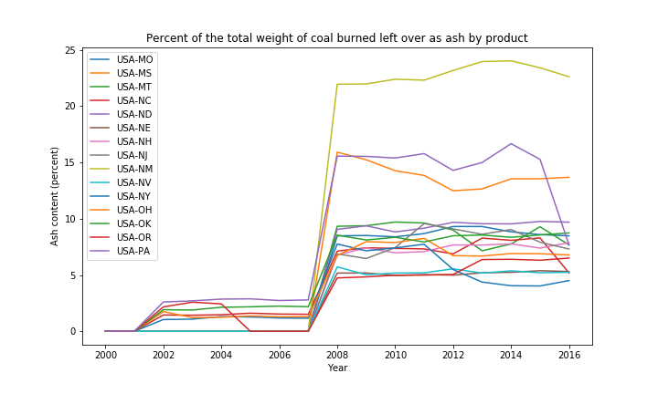

# Energy Statistics

## The Data:
The data set that will be used in this project is called 'US Energy Statistics' and can be found [here.](https://www.kaggle.com/sohier/us-energy-statistics?select=TOTAL.json) It consists of nine JSON files: 
 - **Coal:** Ash content for each US state per year
 - **Electric system operating data:** hourly demand for electric per state
 - **International:** annual petroleum stock per country per year
 - **Natural Gas:**
     - Weekly working underground storage by US region
     - Price and amount of monlthy re-exports to Portugal
     - Weekly and daily futures contracts
 - **Petroleum:**  Cushing, OK WTI Spot Price FOB, Daily
 - **Petroleum Imports:** Monthly imports per US region and international export location, per refinment level
 - **State energy data system:** 
    - Net interstate flow of electricity per state
    - Biomass total consumtion per state
    - Biomass inputs per state

 - **Short term energy outlook:** Quarterly Consumption and production for crude and distilled oil in different sectors internationaly
  - **Total energy:** 
     - Monthly solar energy consumption and generation in residential, and utility-scale sectors
     - Monthly transportation sector total energy consumption and CO2 emissions
     - US department of agriculture and transportation sectors total consumptions annually
     - Primary energy stock change annually

## Questions:

 - **Which US state consumes the most biomass?**
 - **Which state produces the most?**
 - **Statistical differences in production and usege amongst regions.**
 - **What are the "greenest" states**
 - **Compair energy demand between residential, commercial, trasportation, and agruculture and the offset of solar energy**
 - **How much more solar energy needs to be generated to decrease the demand for petroleum energy by a certiain percent?** 

 *The list goes on and on*

## Techniques:
 - frequentist hypothesis testing
 - Lots of maps and graphs
 - 

## Technologies:
 - Python
    - Pandas
    - Numpy
    - Scipy
    - Matplotlib

 __________

 ## Polution

 **Is energy production getting cleaner?** 
 I dug into the coal dataset and pulled out the information on coal ash percentages in diffent sectors. To give my self a summary I averaged the coal ash production produced from burning coal for electrical energy , and plotted each states average over time. </b>
 
</b>
**Waht happend between 2007 and 2008?**
This is a very counter intuitive result considering 2008 is when Obama took office and was pushng for cleaner energy production.
This plot leads me to believe that , due to Obama being elected, energy stations had to change how they report there ash waste around that time. Or, some bush era regulations on coal polution expired around that time. Further research is needed.

**How about CO emission in the same time frame?**

