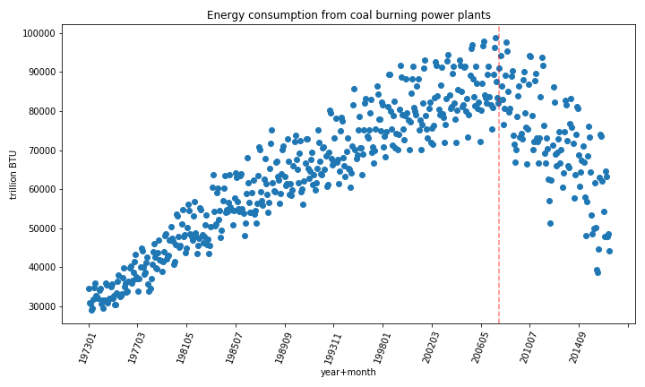

# EDA of Coal Pollution and Clean Energy

## Questions:

 - **Is the US burning coal in a cleaner way now then in the past?** An analysis of coal ash and CO2 emissions
 - **How do clean energy sources stack up against each other, historically and now?**
 - **How does coal consumption/production stack up to or biggest clean energy producer?**
 - **What percent of our total energy usage comes from clean energy sources and is it getting better?**
 

 *The list goes on and on*

 __________

## The Data:
The data set is called 'US Energy Statistics' and can be found [here.](https://www.kaggle.com/sohier/us-energy-statistics?select=TOTAL.json) The data set I am using is from kaggel but the original data comes from The U.S. Energy Information Administration (EIA). It consists of nine JSON files. The files I am using in my exploration are: 
 - **Coal.json:** 
   - Ash content for each US state and region per year/quarter (percent)

 <!--**Electric system operating data:** hourly demand for electric per state
 - **International:** annual petroleum stock per country per year
 - **Natural Gas:**
     - Weekly working underground storage by US region
     - Price and amount of monlthy re-exports to Portugal
     - Weekly and daily futures contracts
 - **Petroleum:**  Cushing, OK WTI Spot Price FOB, Daily
 - **Petroleum Imports:** Monthly imports per US region and international export location, per refinment level
 - **State energy data system:** 
    - Net interstate flow of electricity per state
    - Biomass total consumtion per state
    - Biomass inputs per state

 - **Short term energy outlook:** Quarterly Consumption and production for crude and distilled oil in different sectors internationaly-->
  - **Total.json:** 
    - Monthly/annual solar energy consumption and production in multiple sectors (BTUs)
    - Monthly/annual wind energy consumption and production in multiple sectors (BTUS)
    - Monthly/annual geothermal energy consumption and production in multiple sectors (BTUs)
    - Monthly/annual nuclear energy consumption and production in multiple sectors (BTUs)
    - CO2 from coal burning across multiple sectors monthly (metric tons)

     

### The Raw Data:
I am reading the data in from the individual json files directly to a pandas data frame. Below is a snapshot of what they looked like. The top photo is the left side of the data frame and the bottom photo is the right side: 

<!---->
 
The coal data set has 20 columns and 169,316 rows. The totals data set has 1000 rows 7 columns. In these Jsons, each row has its own data set in itself. Useful columns include name, units, geographical region, and data. The column that actually has the data for each row is the data column. This column consists of a dictionary of years, quarters or months(keys) and the measurements during that time period(value).  
 
My baseline set of helper functions takes this embedded data dictionary, creates a new column for each key, and fills each column with its associated value.

 # Pollution

## Is Coal burning getting cleaner? 
I dug into the coal dataset and pulled out the information on coal ash percentages in different sectors. To give myself a summary I averaged the coal ash percentages over all the sectors , and plotted each state's average over time. </b>
 
 </b>
**Wow is that ugly!** 
The coal ash data in the data set is only given for the 2000s. This plot shows me that reporting of coal ash has been very inconsistent. There are some regions that didn't start reporting until 2008.  
**What happened between 2007 and 2008?**
In 2008 is when Obama took office and was pushing for cleaner energy production. This plot leads me to believe that, due to this push, energy stations had to change how they report their ash waste. 

**This ugly graph is worth showing because it highlights the inconsistency of reporting, especially in 2008, but let's look at the same data in a different way.** Below is the same average percentages but with all US reporting states and regions because they can fit on this type of plot. The black line is the average for that year and the red dashed line sits 2 standard deviations away from the mean.  

 
Now we can see that the average ash percentage across the country was about 6% before 2008 and and after the reporting changed, the average ash content went up to about 9%. The exciting part is that it looks like the percentage is trending down (but I will have to wait until we learn linear regression for that).
 
 
Next, I want to look at the difference in energy sectors but I will narrow my view to clean up what I am looking at. I chose to look at the mountain region of the US because that is where I live. This region did not start reporting until 2008.  

 
There are few things worth noting in this graph. On first inspection "electric utility non-cogen" appears to be missing.  This is because non-cogen utility and independent power measurements of ash are almost exactly the same every year. This makes me wonder if almost all independent power producers do not use cogeneration technologies. Another thing brought to light in this graph is that reporting on electric utility plants seems to have stopped in 2012. Maybe they are reporting in a different class now. As a summary I would say that independent power producers, electric utilities and other industrial areas are not burning coal any cleaner since recording started, but the commercial and industrial industries are making some changes and I would love to see data for the more recent years. (Remember this is only for the mountain region of the us 2008-2016)
 
 
With this data, it is not clear if coal is burning cleaner or not in america. There is a lot of under-reporting, and a clear shifts in reporting standards half way through the data, that it makes analysis difficult.

 

## What can we learn about the cleanliness of coal from US CO2 emissions?
I am first looking into CO2 emission from the residential sector because I am curious as to whether that is still a significant contribution. Below I am plotting the CO2 emissions from coal burning in the residential sector. The data all goes to zero in 2008 which support the idea that in 2008 some reporting standards were changed.

 
<!--zoom in
 
-->

 
CO2 emissions from residential burning decreased exponentially in the 70s , had a little bump in the late 80s and has continued to decrease at a linear looking rate until reporting stopped in 2008 (numbers are not at zero before this). It is known that the amount of houses burning coal for heat has been declining so it is unclear from this data weather the emissions from coal are decreasing or just the consumtion. Let's look at the electric power sector of coal.
 

 

**Are emissions going up or down with consumption?**

 
By compairing these to graphs we can say that that huge decrease in emissions in 2008 may only be due to our decrease consumption of coal, not that our coal burning techneques are cleaner. It is pretty amazing that rate of decrease after 2008 is faster than the rate of increase since reporting started.
 

<!--If we look back to the residential emission graph we can see that (at least prior to 2008) it is negatively correlated to the power plant emissions in some way. As home coal burning emissions decreased, electric emissions increased. When I did a spearman correlation test between residential coal emissions and power plant coal emissions to see if there is a correlation due to more people heating their house with electricity rather than coal. I got a -0.74 correlation coefficient and a two tailed p value of 2.8e-73.I believe this confirms what we see in the two graphs, that as residential emissions decreased the power plant emissions increase. But, I am not confident that the emissions from power plants were increasing because of the decrease in home burning because there is a lot that goes into the power plant emission numbers. There are many users of electric power plants, not just residential heating. Power plant emission could have been on the rise due to burning techniques or growing industrial usage etc.-->
 
Although the coal ash data is hard to evaluate due to the change in reporting in 2008, the CO2 emissions comparied to the coal consumption show us that coal is not getting cleaner, we are just useing less.

_____
# Clean Energy

## How do the clean energy sectors stack up against each other?
 

 
This plot is the production/consumption of all the clean energy sources in the us. The vertical line is on 2008 for reference to the above plots. It looks like our biggest clean energy sector is nuclear. Nuclear and hydroelectric have kept a consistent rate. Wind power has been on the rise since 2005. Possibly reaching the production level of hydroelectric. Solar generated power has been pretty minimal but seems to be ramping up starting around 2013.  

 

## Are clean energy producers anywhere close to reaching coal plant BTUs nationwide?  
 
It appears from the graph above that nuclear power plants are the biggest producers of clean energy. To compair nation wide consumption of electricity from coal plants to electricity from nuclear power plants, I took the monthly average over 17 years of consumtion from each type of plant and compaired them in a bar chart. The diffence in consumtion was so vast over the 17 year span, that you could barely see nuclear consumtion on the chart. I decided to compair just the most recient year because I thought we might see an increased percentage of power coming from this clean energy due to the push against coal after 2008. The graph below shows the average coal consumtion for the past 17 years with the green dots, and the bars represent just 2016.
<!--

This graph above is 17 years of data grouped on the month by average. There is a vast difference in production.-->

The monthly coal production in 2016 was on average 20,983 trillion BTU under the 17 year monthly averages. The difference between coal and nuclear production is still as vast.
 
**Is there a significant difference in our consumption in 2016?**
In other words, Is 2016 production numbers from the same shaped 
population as the last 17 years? My null hypothesis is that there
is no difference in consumption for coal between the last 17 years 
and 2016. My alternative is that there is a significant difference in consumption. I decided to run a mann whitney u test because my samples are not normally distributed and the mann whitney u compares the medians not means.
My result was a p value of .00036.  This is much smaller then the standard significance value of .05, so I will have to conclude that there is no significant differance between our most current year of consumption and the past 17.
 *I would like to point out a couple caveats about this test. My sample sizes were 12 each so the results should be taken lightly. Also, I am not positive that this is independant data because it is comparing date time data*

 

 
## Is our energy consumption getting cleaner as a whole?
Below is a plot of the percentage of total energy consumed in the US that came from clean source every year. At first glance this graph looks great but if you look at the y axis you will see that the percent has only gone up about 10% between 1973 and 2015.
 

 
# In conclusion
Inconsistency within the data makes it hard to see if there is a lower percentage of ash-coal being produced at energy plants. CO2 emissions are a better indicator of whether coal is getting cleaner. There was a huge decline in CO2 from coal fired electric power plants starting in 2008 but there was also a huge decline in production/consumption. I can not say that emissions are decreasing faster then consumption. This huge decrease right at 2018 may be a reflection of a change in reporting standards, or a reflection in Obamas push away from coal. Coal Is still a very big source of energy in the US. By graph the coal consumption seems to be plummeting but statistical tests between the last year and the last 17 years seem to conclude that there is not much difference. Our Highest producing clean energy is still orders of magnitude behind generating as much energy as coal. Other clean energy sectors are even smaller producers but wind and solar have started accelerating their production in the last decade. The bigger picture is that  the total percentage of US energy that comes from clean energy sources is increasing, but at a very small rate.

America,  you can do better .
