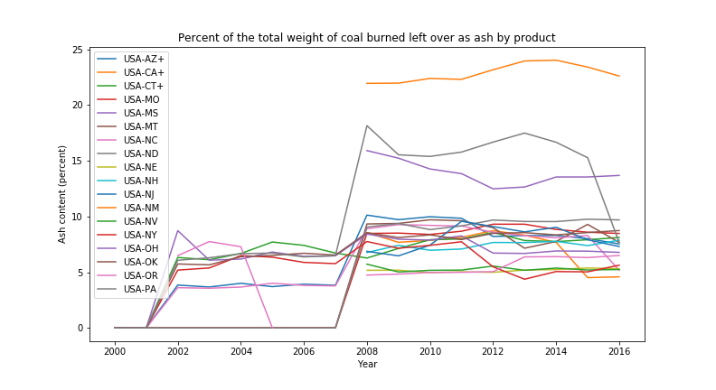
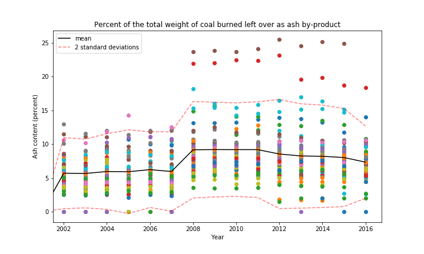
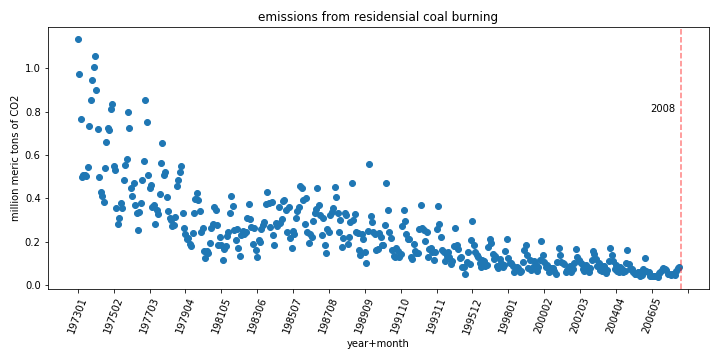
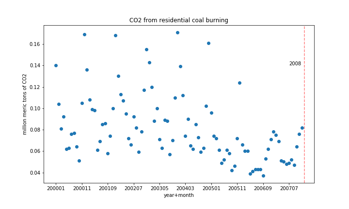
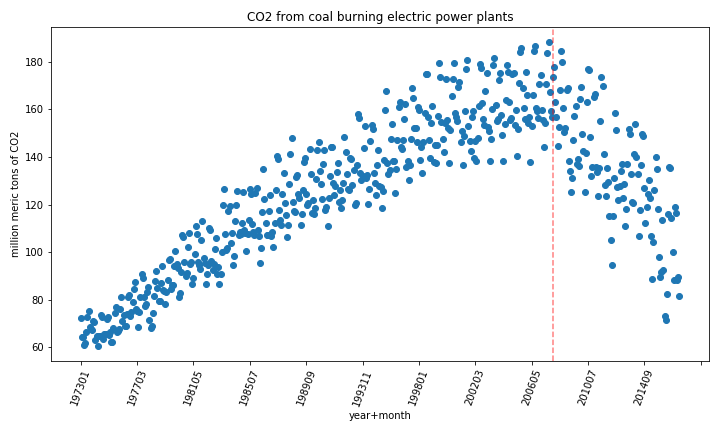
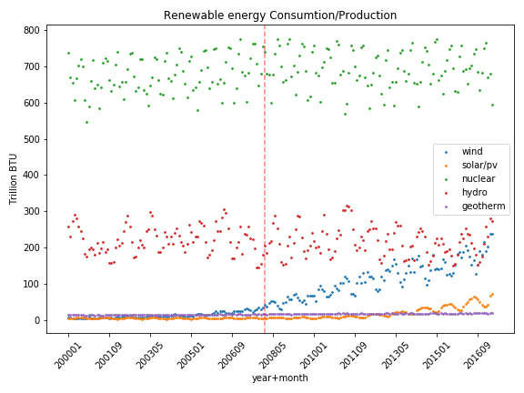
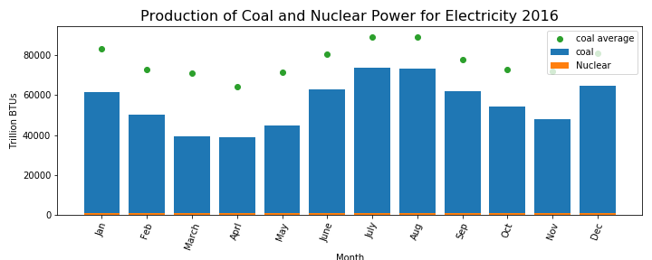
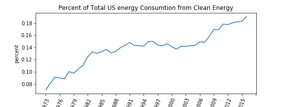

# Energy Statistics

## The Data:
The data set  is called 'US Energy Statistics' and can be found [here.](https://www.kaggle.com/sohier/us-energy-statistics?select=TOTAL.json) It consists of nine JSON files. The files I use in my exploration are 
 - **Coal:** 
   - Ash content for each US state and region per year/quarter 
   

 <!--**Electric system operating data:** hourly demand for electric per state
 - **International:** annual petroleum stock per country per year
 - **Natural Gas:**
     - Weekly working underground storage by US region
     - Price and amount of monlthy re-exports to Portugal
     - Weekly and daily futures contracts
 - **Petroleum:**  Cushing, OK WTI Spot Price FOB, Daily
 - **Petroleum Imports:** Monthly imports per US region and international export location, per refinment level
 - **State energy data system:** 
    - Net interstate flow of electricity per state
    - Biomass total consumtion per state
    - Biomass inputs per state

 - **Short term energy outlook:** Quarterly Consumption and production for crude and distilled oil in different sectors internationaly-->
  - **Total energy:** 
     - Monthly/anual solar energy consumption and production in multiple sectors
     - Monthly/anual solar energy consumption and production in multiple sectors
     - Monthly/anual solar energy consumption and generation in multiple sectors
     - US department of agriculture and transportation sectors total consumptions annually

## Questions:

 - **Which state produces the most?**
 - **Statistical differences in production and usege amongst regions.**
 - **What are the "greenest" states**
 - **Compair energy demand between residential, commercial, trasportation, and agruculture and the offset of solar energy**
 

 *The list goes on and on*

## Techniques:
 - frequentist hypothesis testing
 - Lots of maps and graphs
 - 

## Technologies:
 - Python
    - Pandas
    - Numpy
    - Scipy
    - Matplotlib

 __________

## The Raw Data:
I read the data in from the individual json files directly to a pandas data frame: Below is a snap shot of what they looked like. The top photot is the left side of the data framt and the bottom photo is the right side: 

<!---->
 
In this data set there was 20 columns and so many rows it was crashing my kernal so i read in only 1000 rows. Each row has a is a data set in intself. There is a couple long sting descriptino columns, units, source, geografical region, copyright, last updated and more. there are more columns then many of the rows have entries for so there are alot on nan values. The column that actually has the data for each row is the data column. This column consists of a dictionary of years(keys) and the measurments during that year(value). some of the rows are reported quartery and some are reported annually.  
 
My baseline wranggler set of helper functions takes this imbedded data dictionay, creates a new column for each key (year) and fills each column with its associated values.

 # Polution

## Is Coal burning getting cleaner? 
 I dug into the coal dataset and pulled out the information on coal ash percentages in diffent sectors. To give my self a summary I averaged the coal ash production produced off all the sectors , and plotted each state's/region's average over time. </b>
 
 </b>
**Wow is that ugly!** 
This plot shows me that reporting of coal ash has been very inconsistent. There are some regions that stop reporting then start again.  
**What happend between 2007 and 2008?**
In 2008 is when Obama took office and was pushng for cleaner energy production. This plot leads me to believe that , due to Obama being elected, energy stations had to change how they report there ash waste around that time. Or, some Bush era regulations on coal polution expired around that time. Further research is needed. 
**This ugly graph is worth showing because it highlights the inconsistancy of reporting, especialy in 2008, but lets look at the same exact data in a different way.** 

Now we can see that that the average ash percentageacross the country was about 6% before 2008 and and after the reporting changed, the average ash content went up to 9%. THe exciting part is that it looks like the percentage is trending down but Ill have to wait until we learn linear regression for that ;) 
 
Next, I wanted to look at the diffence in energy sectors but i wanted to narrow my view to clean up what im looking at. I decided to look at the mountain region of the US because that is where I live.  

 
There are few things worth noteing in this graph. On first inspection "electric utility non-cogen" appears to be missing.  This is because non-cogen utility and independent power measurments of ash are almost exactly the same every year. This make me wonder if almost all independant power producers do not use cogeneration technologies. Another thing brought to light in this grapg is that reporting on electric utility plants seems to have stopped in 2012. As a summary I would say that independant power producers, electric utility and other industrial are are not burning coal any cleaner since recording started, but the commercial and industrial is making some changes and I would love to see data for the more recient years. (Remember this is only for the mountain region of the us)
 
 
I think we can say that with this data It is not clear if coal is burning cleaner or not in america. There is alot of underr reporting, and a clear shift in reporting standard half way through the data, that it makes analysis difficult. 

 
 

## How about CO2 emission in the same time frame?

zoom in

 
As a quick peek into CO2 emissions reporting, I plotted the CO2 emissions from coal burning in the resedential sector. The data all goes to zero which support the idea that in 2008 some reporting standards were changed. 
 
**Lets look more boadly**  A good portion of our coal energy is to produce electrisity. Lets look there.

This graph is more revealing and supports the idea that emission standards changed 2008. It also reviels that those standards are working. The rate of decreas is faster then the rate of increase since reporting started.

Although the coal ash data is hard to evaluate due to the change in reporting in 2008, the new standards are really healping polution do to CO2 emissions
_____
## Clean Energy

 
This plot is the production/consumption of all the renewable energy sources in the us. The verticle line is on 2008, during the administration and policy changes. It looks like our primary renewable energy sectors, nuclear and hydroelectric kept as a consistant rate. Wind power was alreay on the rise starting in abour 2005 but it really rampted up after 2008. Was there more money being diverted in to wind or was this rise enevitable? Solar genrated power didnt make any changes in 2008 but has started to ramp up around 2013. This may be due to the technology becomeing more afordable or more efficiant.  

It is also a hopeful observation to see that at the curent rate solar energy production may over come hydro electric power. This is exciting becasue thereare some arguments against hydro electric power sources due to the destruction of river ecosystems and the social threats when dam construction destroys riverside commuities up streal from the damn.
 

**Are we anyware close to overcomeing coal plant production with any of there renewable energys?**  

It apears from the graph above that nuclear produces by far the most energy. Lets see how this compairs to coal fired electric plants.

NOPE
 
 
But maybe energy is getting cleaner. What about if we look at the most recient year alone (2016)
?  

The monthly coal production in 2016 was on average 20983 trillion BTU under the 17 year monthy averages. The diffence beween coal and nuclear production is still as vast.

 
 

**Maybe we can get a better picture of clean vs dirty energy by look at the percentage of each in our total energy consumtion**

YAY
