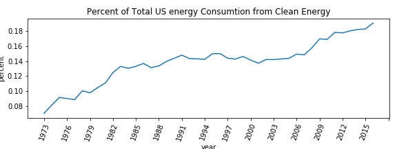

# EDA of Coal Polution and Clean Energy

## Questions:

 - **Is the US burning coal in a cleaner way now then in the past?** An analysis of coal ash and CO2 emissions
 - **What do historic CO2 emissions from coal look like between sectors? Is it decreasing?**
 - **How do clean energy sources stack up against each other, historialy and now?**
 - **How does coal consumtion/production stack up to or buggest clean energy producer?**
 - **What percent of our total energy useage come from clean energy sourses and is it getting better?**
 

 *The list goes on and on*

 __________

## The Data:
The data set is called 'US Energy Statistics' and can be found [here.](https://www.kaggle.com/sohier/us-energy-statistics?select=TOTAL.json) The data set am useing is from kaggel but the origonal data comes from The U.S. Energy Information Administration (EIA). It consists of nine JSON files. The files I am useing in my exploration are: 
 - **Coal.json:** 
   - Ash content for each US state and region per year/quarter (percent)

 <!--**Electric system operating data:** hourly demand for electric per state
 - **International:** annual petroleum stock per country per year
 - **Natural Gas:**
     - Weekly working underground storage by US region
     - Price and amount of monlthy re-exports to Portugal
     - Weekly and daily futures contracts
 - **Petroleum:**  Cushing, OK WTI Spot Price FOB, Daily
 - **Petroleum Imports:** Monthly imports per US region and international export location, per refinment level
 - **State energy data system:** 
    - Net interstate flow of electricity per state
    - Biomass total consumtion per state
    - Biomass inputs per state

 - **Short term energy outlook:** Quarterly Consumption and production for crude and distilled oil in different sectors internationaly-->
  - **Total.json:** 
     - Monthly/anual solar energy consumption and production in multiple sectors (BTUs)
     - Monthly/anual wind energy consumption and production in multiple sectors (BTUS)
     - Monthly/anual geothermal energy consumption and production in multiple sectors (BTUs)
     - Monthly/anual nuclear energy consumption and production in multiple sectors (BTUs)
     - CO2 from coal buring across multiply sectors monthly (metric tons)
     

### The Raw Data:
I am reading the data in from the individual json files directly to a pandas data frame. Below is a snap shot of what they looked like. The top photo is the left side of the data frame and the bottom photo is the right side: 

<!---->
 
In this data set there are 20 columns and 169,316 rows. Each row has a is a data set in intself. Useful columns include name, units, geografical region, and data. The column that actually has the data for each row is the data column. This column consists of a dictionary of years, quarters or months(keys) and the measurments during that time period(value).   
 
My baseline set of  set of helper functions takes this imbedded data dictionay, creates a new column for each key and fills each column with its associated value.

 # Polution

## Is Coal burning getting cleaner? 
 I dug into the coal dataset and pulled out the information on coal ash percentages in diffent sectors. To give my self a summary I averaged the coal ash percentages over all the sectors , and plotted each state's average over time. </b>
 
 </b>
**Wow is that ugly!** 
The coal ash data in the data set is only given for the 2000s. This plot shows me that reporting of coal ash has been very inconsistent. There are some regions that didnt start reporting until 2008.  
**What happend between 2007 and 2008?**
In 2008 is when Obama took office and was pushng for cleaner energy production. This plot leads me to believe that, due to this push, energy stations had to change how they report there ash waste.
 
**This ugly graph is worth showing because it highlights the inconsistancy of reporting, especialy in 2008, but lets look at the same data in a different way.** Below is the same average persentages but with all US reporting states and regions becasue they can fit on this type of plot. The black line is the average for that year and the red dashed line sits 2 standar deviations away from the mean. 

Now we can see that that the average ash percentage across the country was about 6% before 2008 and and after the reporting changed, the average ash content went up to about 9%. The exciting part is that it looks like the percentage is trending down (but Ill have to wait until we learn linear regression for that).  
 
Next, I want to look at the diffence in energy sectors but I will narrow my view to clean up what I am looking at. I have to look at the mountain region of the US because that is where I live. This region did not start reporting until 2008.  

 
There are few things worth noteing in this graph. On first inspection "electric utility non-cogen" appears to be missing.  This is because non-cogen utility and independent power measurments of ash are almost exactly the same every year. This make me wonder if almost all independant power producers do not use cogeneration technologies. Another thing brought to light in this graph is that reporting on electric utility plants seems to have stopped in 2012. Maybe they are reporting in a different class now. As a summary I would say that independant power producers, electric utility and other industrial are are not burning coal any cleaner since recording started, but the commercial and industrial is making some changes and I would love to see data for the more recient years. (Remember this is only for the mountain region of the us 2008-2016)
 
 
With this data, it is not clear if coal is burning cleaner or not in america. There is alot of under-reporting, and a clear shifts in reporting standards half way through the data, that it makes analysis difficult. 

 

## What can we learn about coal from US CO2 emissions?
I am first looking into CO2 emission fromresedential sector because I am curious as to wether that is still a significant contribution. Below I am plotting the CO2 emissions from coal burning in the resedential sector. The data all goes to zero in 2008 which support the idea that in 2008 some reporting standards were changed.

 
<!--zoom in
 
-->

 
CO2 emissions from residential burning decreased exponentially in the 70s , had a little bump in the late 80s and has continued to decrease at a linear looking rate until reporting stopped in 2008 (number are not at zero before this). US citizens must be getting ther heat from some where though. Lets look at the electric power sector of coal.

  

The red dashed line on this graph below is on the year 2008. 
This graph either shows that clean coal technoogies drasticaly decreased the CO2 emissions from coal burning electric power plants and/or we suddenly used alot less coal to genrate power. This also may supports the idea that emission standards changed 2008. The rate of decrease after 2008 is faster then the rate of increase since reporting started. 

From these two graphs we can see that (at least prior to 2008) they are negativly coralated in some way. As come coal burning decreased, electric use went up.

Although the coal ash data is hard to evaluate due to the change in reporting in 2008, the new standards seem to be helping decrease polution do to CO2 emissions.
_____
# Clean Energy

## How do the do the clean energy sectors stack up against each other?
 

 
This plot is the production/consumption of all the clean energy sources in the us. The verticle line is on 2008 for reference to the above plots. It looks like our biggest clean energy sector is nuclear. Nuclear and hydroelectric have kept a consistant rate. Wind power has been on the rise since 2005. Possibly reaching theproduction level of hydroelectric. Solar genrated power has been pretty minimal but seems to be ramping starting around 2013.  

 

## Are clean energy producers anywhere close to reaching coal plant BTUs nationwide?  

It apears from the graph above that nuclear power plants are the biddest produceress of clean energy. Lets see how this compairs to coal fired electric plants.

This graph above is 17 years of data grouped on the month by average. There is a vast difference in production. 
 
 
But maybe energy is getting cleaner. What about if we look at the most recient year alone (2016)
?  
 

The monthly coal production in 2016 was on average 20,983 trillion BTU under the 17 year monthy averages. The diffence beween coal and nuclear production is still as vast.

 

## Is our energy consumtion getting cleaner as a whole?
Below is a plot of the percentage of total energy consumed in the US that came from clean source every year. At fist glance this grph looks grea but is you look tot the y axis you will see that the percent has only gone up about 10% between 1973 and 2015. 
 

America,  you can do better .
